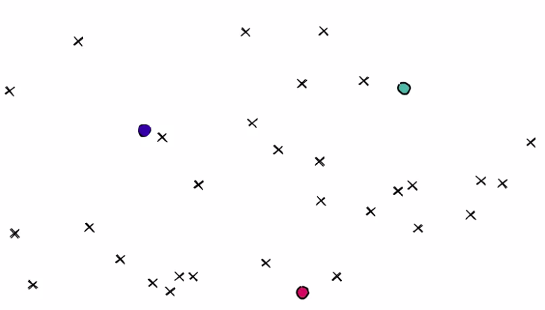
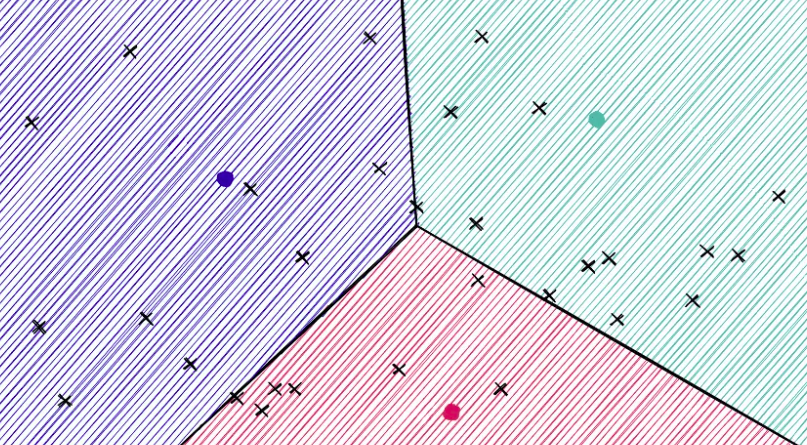
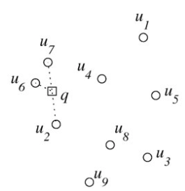
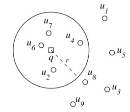
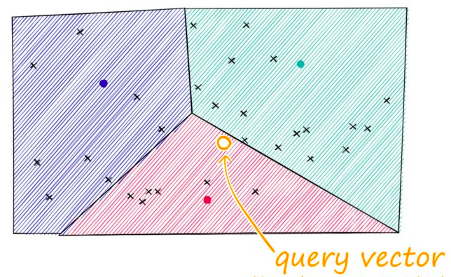

# Proyecto 2 y 3 - BD II

# Integrantes

| <a href="https://github.com/jmac-94" target="_blank">**Josué Mauricio Arriaga Colchado**</a> | <a href="https://github.com/NicolasArroyo" target="_blank">**Nicolas Mateo Arroyo Chávez**</a> | <a href="https://github.com/Gabrieleeh32159" target="_blank">**Gabriel Espinoza**</a> | <a href="https://github.com/Gabrieleeh32159" target="_blank">**Max Antúnez**</a> |
| :----------------------------------------------------------------------------------------------: | :----------------------------------------------------------------------------------: | :-----------------------------------------------------------------------------------------: | :-----------------------------------------------------------------------------------------: |
|  |  |  |  |

# Introducción
## Objetivo
## Dominio de datos
Para la primera parte del proyecto nos hemos basado en la indexación de canciones de Spotify, de modo que guardamos el nombre de la canción, su autor/a y la letra completa.

Por otro lado, para la segunda parte hemos indexado los propios audios de las canciones de Spotify. Específicamente, dado los .wav de cada canción, hemos calculado los Mel-frequency cepstral coefficients (MFCCs) para guardar las señales de audio en una representación compacta que captura frecuencias importantes a través del tiempo aplicando una transformada de Fourier, dejando de lado a señalos sin importancia como son el ruido de fondo, volumen, tono, etc. Después, se ha aplicado una normalización a cada una de estas representaciones para asegurar una misma cantidad de datos por cada vector representativo y así poder indexarlo con técnicas avanzadas provenientes de librerías de Python. 

## Importancia de la indexación
La indexación de los datos que hemos realizado en el proyecto es importante por las siguientes razones:

1. Permite un manejo mucho más rápido de consultas, pues los registros son mucho más rápidos de encontrar en distintas situaciones donde el índice puede ser aprovechado.
2. Genera acceso a consultas mucho más específicas. Por ejemplo, para poder la canción de Spotify más similar a un audio se puede usar los índices de la segunda parte del proyecto aún cuando solo se tiene una parte de la canción completa como consulta.
3. Facilita el uso de técnicas de retrieval mucho más eficientes y adecuadas para contextos específicos que un cliente puede necesitar, como es el caso de K-NN.

# Backend: Índice Invertido
## Construcción del índice invertido en memoria secundaria usando SPIMI
Para un mejor manejo a la hora de realizar la indexación, se han creado 3 clases: ```InvIndexKey```, ```InvIndexValue``` e ```InvIndex```, donde las dos primeras guardan la información principal de nuestro índice invertido y la tercera las agrupa dentro de una sola estructura, agregando métodos que las combinan y abstrayendo la lógica.

En primer lugar, se crea un nuevo objeto ```InvIndex``` al que se le agregará los documentos a indexar mediante el uso del método ```index_docs```. Por cada documento a procesar, ejecutará el método ```proccess_content``` el cual irá llenando el diccionario de ```InvIndexKey```:```InvIndexValue``` que tiene el objeto principal, haciendo uso de un stemmer y de las stop words que este brinde. 

A la hora de añadir un nuevo objeto al diccionario calculamos si el peso futuro de nuestro objeto sobrepasa los límites dados de memoria total del sistema. En caso sí lo sobrepase, mandamos el diccionario actual a memoria secundaria haciendo uso de JSON, para luego vaciarlo y seguir con el proceso, creando dentro del directorio actual a una serie de bloques ```block_n.json```.

Finalmente, cuando ya hallamos mandado a memoria secundaria a todos los bloques necesarios para representar los tokens de los documentos actuales, realizamos un merge de los bloques usando el método ```merge_and_save_blocks```, el cual extraerá los bloques iniciales uno a uno para no sobrepasar el límite de memoria e irá llenando un nuevo diccionario ordenado, creando un nuevo bloque final ```merged_block_n.json``` antes de sobrepasar el límite de memoria, para seguir después con el proceso.

## Ejecución óptima de consultas aplicando Similitud de Coseno
A la hora de realizar queries, primero tokenizamos todos los elementos de la misma. Después, calculamos los valores necesarios para un correcto retrieval y aplicar la similitud de cosenos. Finalmente, buscamos entre los ```merged_block_n.json``` para calcular los documentos más similares a mostrar. 

## Construcción del índice invertido en PostgreSQL/MongoDB

# Backend: Índice Multidimensional
## Técnica de transformación de audio a vector característico usada
## Técnica de indexación de las librerías utilizadas
### Rtree

### Faiss
Usamos el ```Inverted Index File Flat``` el cual consiste en agrupar en n clusters los vectores característicos mediante los diagramas de Voronoi.

Parámetros:
- Quantizer: Objeto que divide el espacio en regiones más pequeñas.
- d: Dimensión de los vectores.
- nlists: Cantidad de clusters.
- metric: Metrica usada para la distancia.
- nprobe: Cantidad extra de clusters en los que buscar en una consulta.

```python
dimension = vectors.shape[1]
nlist = n
quantizer = faiss.IndexFlatIP(dimension)
index = faiss.IndexIVFFlat(quantizer, dimension, nlist)
index.nprobe = nprobe
```

**Pasos de construcción:**
1. Datos: Colocar los vectores normalizados como puntos en el espacio.
2. Selección de centroides: Se eligen n centroides (parámetro ```nlist```), que son puntos, al azar o mediante el algoritmo n-means (k-means).



3. Clustering: Cada punto se asigna al centroide/cluster más cercano mediante el cálculo de la distancia.



4. Creación de listas invertidas: Por cada cluster se crea una lista invertida de los puntos que pertenecen a él.

## Búsquedas
### Sequential
#### KNN-heap
En primer lugar, se itera punto por punto de la colección y se calcula su distancia con el query vector. Después, se crea un heap con la finalidad de mantener siempre los k más cercanos. Finalmente, una vez recorrida toda la colección se ordena el heap y se retorna como una lista.



#### Por rango
En primer lugar, se itera punto por punto de la colección y se calcula su distancia con el query vector. Si la distancia de este punto es menor al radio r dado entonces se agrega al resultado final.



El radio para la consulta se selecciona mediante el análisis de la distribución de la data, donde a partir de un percentil (% de data que queremos hallar entorno a la query) se calcula un radio. 

El radio de búsqueda se calcula a partir del percentil escogido, reflejando el porcentaje de puntos que deseamos incluir alrededor del punto de consulta. Esto permite que el radio se ajuste a la densidad de nuestro conjunto de datos.

### Rtree
### Faiss
1. Cluster más cercano: Elegir el cluster a menor distancia del query vector.
2. Búsqueda en el cluster más cercano: Se busca los k vecinos más cercanos dentro de la lista invertida del cluster más cercano.
3. Problema del borde: Si el query vector cerca de otros clusters pueden existir puntos más cercanos a él en esos otros clusters. Por ello, se busca en cierta cantidad de clusters vecinos además del más cercano (parámetro ```nprobe```).



## Maldición de la dimensionalidad
## Mitigar la maldición de la dimensionalidad

# Frontend
## Diseño GUI
### Manual de uso
Primero se debe obtener una Spotify API Key. Para esto se debe hacer la siguiente request con la información correspondiente.

```zsh
curl -X POST "https://accounts.spotify.com/api/token" \
     -H "Content-Type: application/x-www-form-urlencoded" \
     -d "grant_type=client_credentials&client_id=your-client-id&client_secret=your-client-secret"

```

### Screenshots
## Análisis comparativo visual con otras implementaciones

# Experimentación
## Resultados experimentales
## Análisis y discusión
